# AI Generated Art

AI generated pieces created using **Grok Imagine** (xAI's own image model), **ChatGPT / DALL E 3**, and **Sora** (OpenAI video to frames). Developed as part of **[The Beaks](https://x.com/thebeaksart)** — an NFT art project by multidisciplinary artist Dima Kashtalyan (@DKashtalyan). The Beaks is a surreal character collection exploring the intersection of street art, fashion, and blockchain identity.

Each entry shows the full prompt to output workflow with critique — exactly the kind of annotation work this role requires for training Grok's image understanding. The QR code elements, present across multiple pieces, are a deliberate design motif for the collection's token gated access and character identity system.

---

## AI-01: Scientist Cat

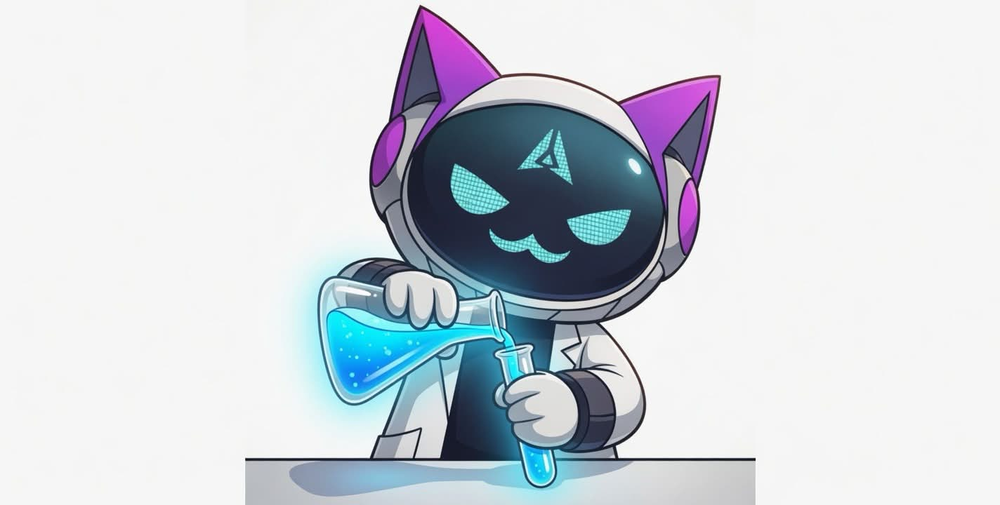

**Tool:** Grok Imagine

**Prompt:** robot cat scientist pouring glowing liquid, clean illustration, white background, purple and teal accents

**What I see:** Centered medium shot on stark white — subject dominates with no distractions. Strong clean light with emissive glow from the liquid draws the eye to the action. Limited palette of white, purple, teal, and black keeps it high contrast and visually sharp. Clean cartoon style with bold outlines.

**What I'd change:** The white background leaves the character floating — a subtle ground shadow or environmental element would anchor the scene.

**Project context:** The Beaks character development — exploring scientist and engineer archetypes for the collection's lore.

---

## AI-02: QR Code Flamingo (Fashion)

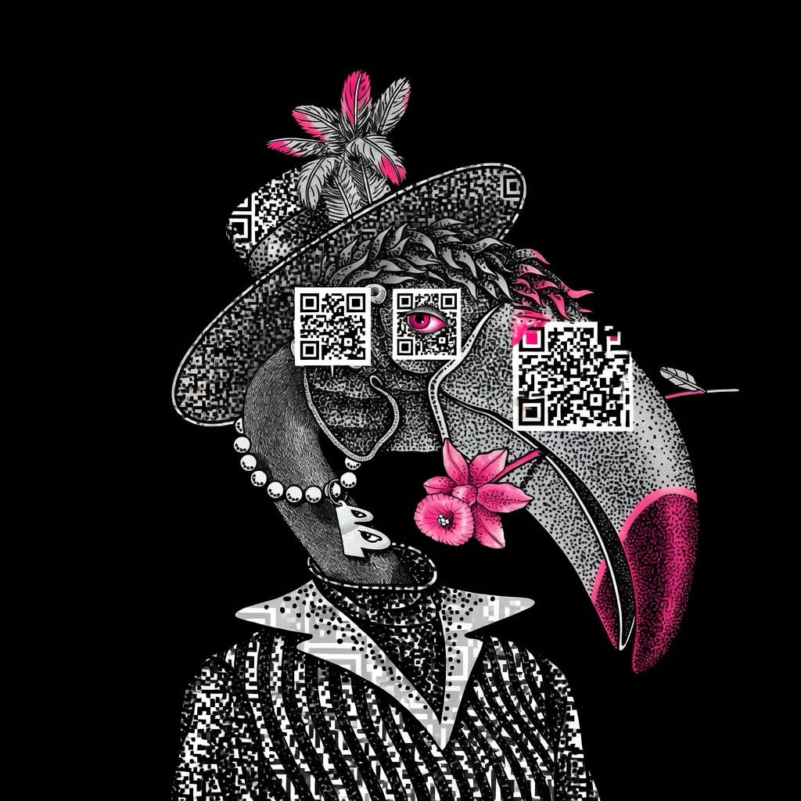

**Tool:** Grok Imagine

**Prompt:** anthropomorphic flamingo wearing fashion accessories, QR code patterns, black background

**What I see:** Frontal close up on black background with tight focus on the character's head and upper body. Even flat light with no strong shadows keeps it clean and readable. Black, white, and pink palette creates high contrast with a slightly surreal feel. Flat graphic illustration with QR codes integrated as fashion texture.

**What I'd change:** The flat lighting flattens the beak's form — a rim light from one side would define the shape and add depth.

**Project context:** The Beaks — QR codes serve as the collection's identity system. Holders scan to verify authenticity and unlock access.

---

## AI-03: Space Toucan

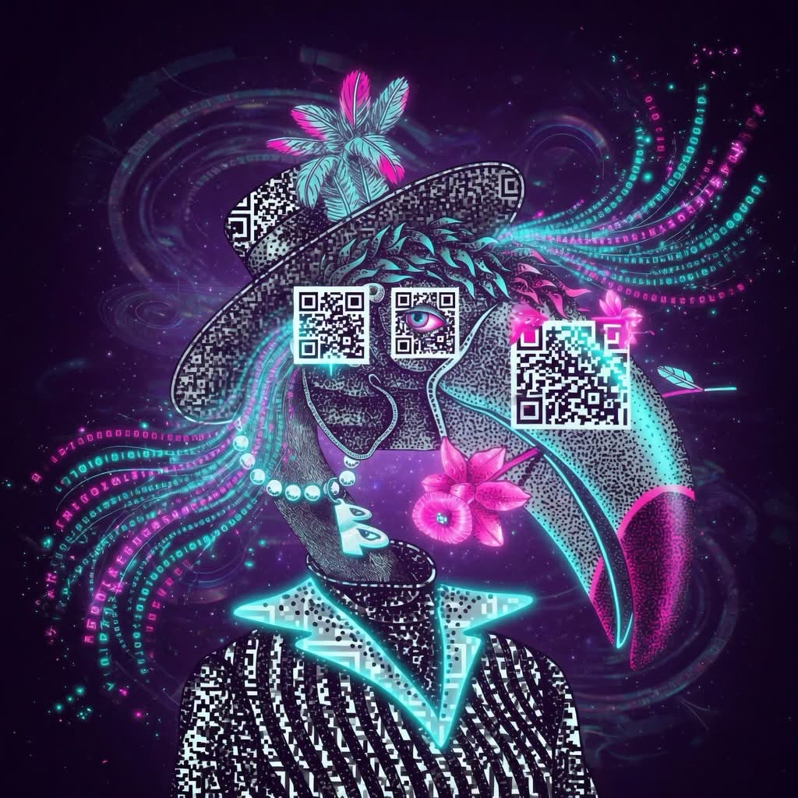

**Tool:** Grok Imagine

**Prompt:** toucan like creature avatar, sophisticated look, QR codes, space star background, neon accents

**What I see:** Symmetrical centered portrait with layered elements of digital codes and floral motifs over a dark starry background. Dramatic neon accents highlight borders and elements with high contrast. Cool purple and teal mixed with bright pink accents against black and white creates a futuristic psychedelic feel. Highly stylized NFT art aesthetic.

**What I'd change:** The star background competes with the character's silhouette — dimming the background elements would push the subject forward.

**Project context:** The Beaks — this piece explores the celestial variant of the character set, using space motifs to signify rarity tier.

---

## AI-04: Flamingo Portrait (Symmetrical)

**Tool:** Grok Imagine

**Prompt:** fashionable anthropomorphic flamingo, symmetrical close up portrait, QR code textures, black background

**What I see:** Symmetrical centered close up portrait against stark black. Strong contrast with highlights and shadows creating a block like texture effect. Limited black, white, and pink palette with high impact. Contemporary surrealism with QR codes as generative texture and blocky rendering.

**What I'd change:** The blocky texture from the QR encoding could be softened at the edges — the face reads clearly but the neck blends into the background.

**Project context:** The Beaks — a core character variant. The symmetry approach makes it work as both a standalone piece and a PFP.

---

## AI-05: Data Face (Abstract)

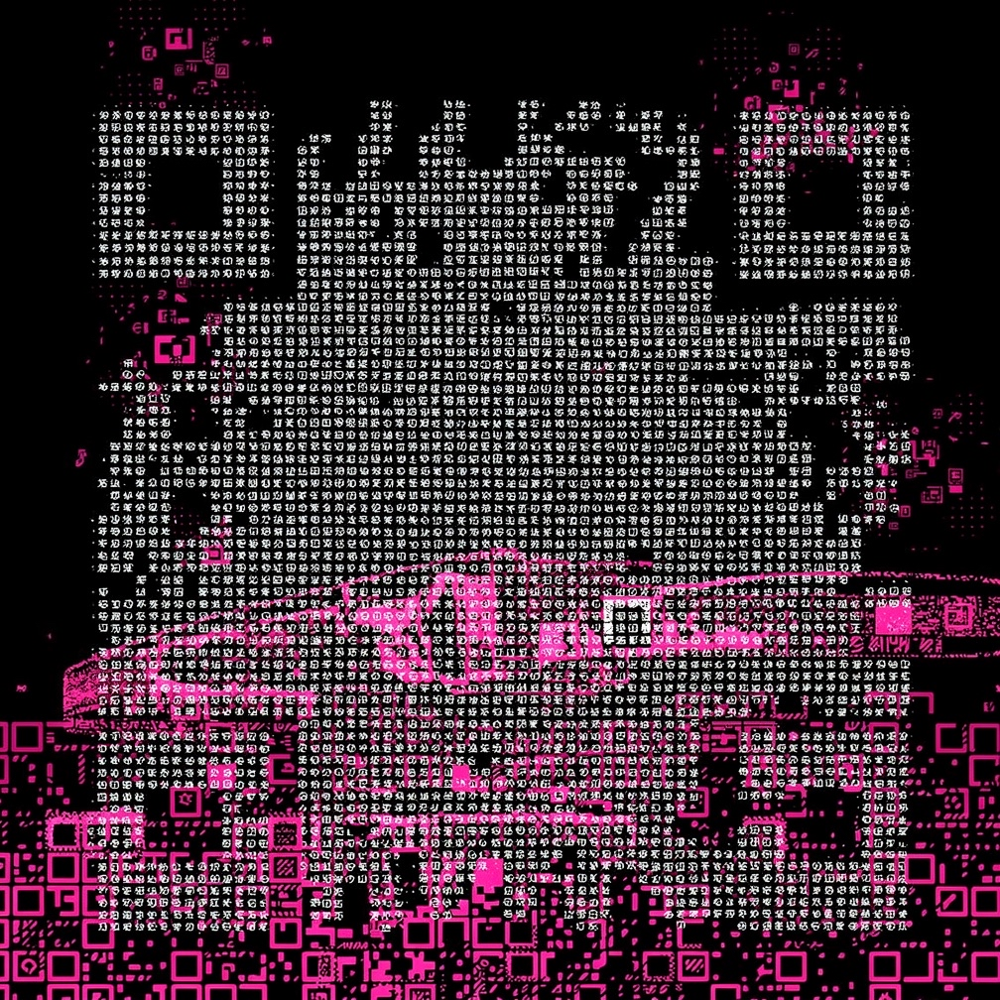

**Tool:** Grok Imagine

**Prompt:** abstract representation of text and data forming a face, grid like arrangement, cyberpunk aesthetic, hot pink accents

**What I see:** Dense grid like arrangement of repeating patterns. Symmetrical composition draws the eye to the implied face in the center. No natural lighting — flat uniform color with selective glows and highlights. Black and white with vibrant hot pink accents creates a cyberpunk palette. Glitch art and data driven aesthetic with code based visual language.

**What I'd change:** The face reads as an optical illusion more than a clear form — sharper delineation of facial features would make the emergent face concept hit harder.

**Project context:** The Beaks — abstract and data driven variant exploring the collection's underlying theme of identity as information.

---

## AI-06: Drake Reject

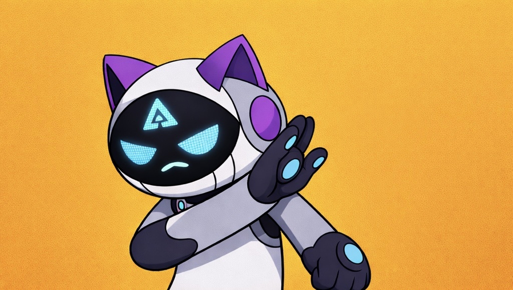

**Tool:** ChatGPT / DALL E 3

**Prompt:** robotic cat character, arms crossed in rejecting pose, orange background, stern expression, Drake meme style

**What I see:** Centered composition with arms crossed pose inspired by the Drake reject meme format. Soft illustrative lighting from the face direction gives depth to the robotic features. White, grey, and purple against a warm orange background creates complementary contrast. Simplified cartoon with clean lines and slight grain texture.

**What I'd change:** The background color competes with the warm accents in the character — a cooler background tone would let the character pop more.

**Project context:** The Beaks — robotic cat character line exploring how the collection's style translates to non avian subjects.

---

## AI-07: Drake Approve

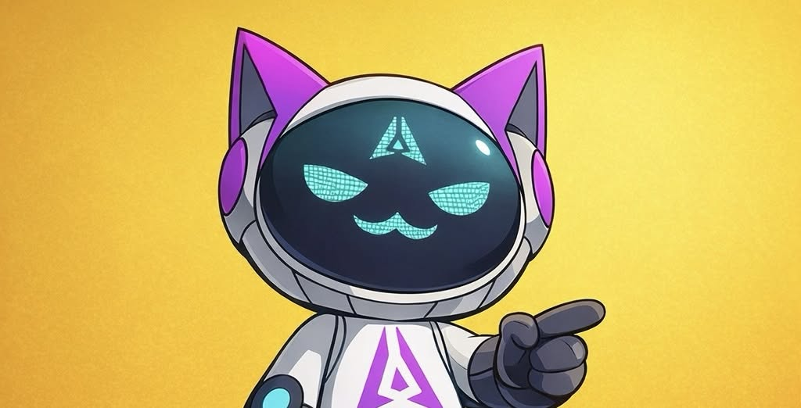

**Tool:** ChatGPT / DALL E 3

**Prompt:** robotic cat character pointing forward, approving expression, bold yellow background, Drake meme style counterpart

**What I see:** Centered medium shot with the character pointing forward in the Drake approve pose, creating direct engagement. Flat even lighting with minimal shadows for clean readability. Purple, white, grey, and turquoise on warm yellow — saturated, bold, and modern. Clean bold lines with polished rendering and detailed textures on the face.

**What I'd change:** The pointing arm lacks the texture detail present in the face — maintaining consistent rendering fidelity across all elements would strengthen the piece.

**Project context:** The Beaks — action pose variant for the collection's marketing and promotional assets. Works as a matching pair with AI-06.

---

## AI-08: Armored Crystal Bearer

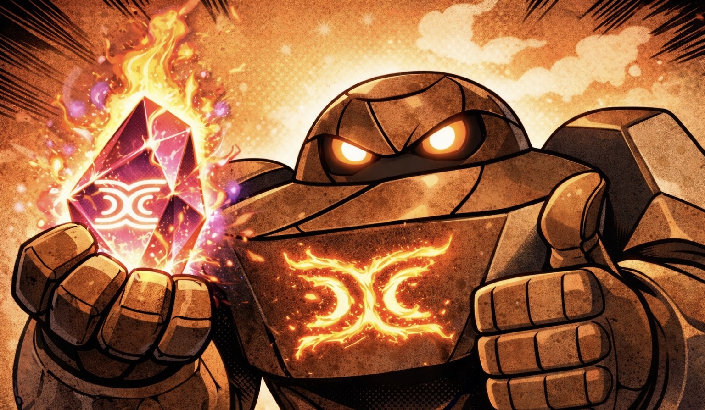

**Tool:** Grok Imagine

**Prompt:** large armored character holding glowing crystal, close up filling the frame, comic book style, warm earthy tones

**What I see:** Close up filling the frame creates power and focuses attention on the central crystal. Dramatic lighting with strong internal glow effects from the crystal and body. Warm earthy tones of oranges, browns, and purples with bright highlights. Comic book style with heavy linework, bold colors, and an animated feel.

**What I'd change:** The armor details on the left side get lost in shadow — a subtle bounce light from the crystal side would reveal more form.

**Project context:** The Beaks — legendary and rare variant. The glowing crystal ties into the collection's lore around power sources and token utility.

---

## AI-09: GenLayer Mascot (Cyber Cat Astronaut)

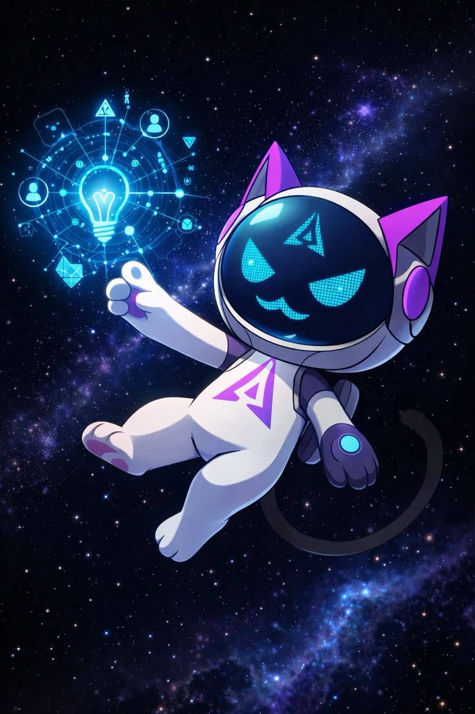

**Tool:** Sora (OpenAI video generation — extracted frame)

**Prompt:** GenLayer mascot character, cyber cat astronaut floating in space, white spacesuit, purple and blue glowing accents, lightbulb idea icon above head, starry background

**What I see:** Dynamic diagonal floating pose against a starry space backdrop. The lightbulb idea icon above the head creates a clear narrative focal point. The glowing lightbulb and helmet display serve as dual light sources, softly illuminating the character's face against the dark space. White spacesuit with purple and blue glowing accents against deep dark space gives a futuristic tech focused mood. Polished 3D rendered character design with clean lines.

**What I'd change:** The starry background could use some nebula color to match the purple and blue glow scheme — would tie the palette together more cohesively.

**Project context:** Created as the mascot for **GenLayer** — an AI powered blockchain platform. This piece required maintaining consistent character identity across different poses and contexts.

---

## AI-10: DP x GenLayer Mascot Fusion

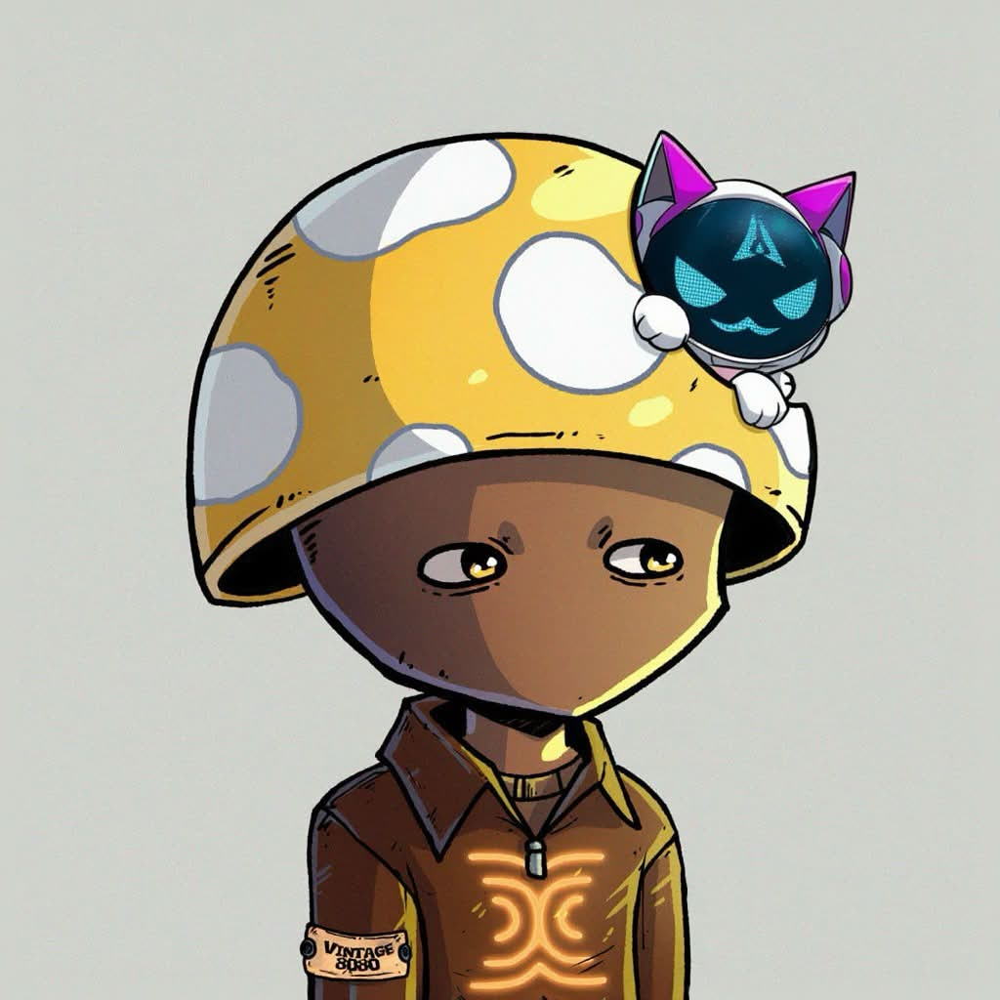

**Tool:** Sora (OpenAI video generation — extracted frame)

**Prompt:** mushroom headed character with white spots, small robot cat perched on mushroom top, Vintage 3030 patch, brown collared shirt with glowing neon symbol, reimagined as futuristic space explorer with purple and blue glowing accents, lightbulb idea icon, starry space background

**What I see:** Front facing static pose with the character centered. The small robot cat on the mushroom cap creates a nested character dynamic, adding visual interest at the top of the frame. Soft even lighting with subtle shading on facial features and clothing — the neon symbol provides a focal glow point on the chest. Yellow mushroom cap with white spots, brown character skin, dark brown shirt, with purple and blue glowing accents creates a warm earthy base with cool neon contrast. Digital illustration with cartoon and NFT art aesthetic.

**What I'd change:** The expression reads as slightly concerned or contemplative — a more confident expression would match the space explorer theme better.

**Project context:** Fusion piece combining the artist's personal mascot (dp character) with GenLayer's visual identity — demonstrating the ability to blend two distinct brand aesthetics into a cohesive character design.

---

## AI-11: Blue Cat

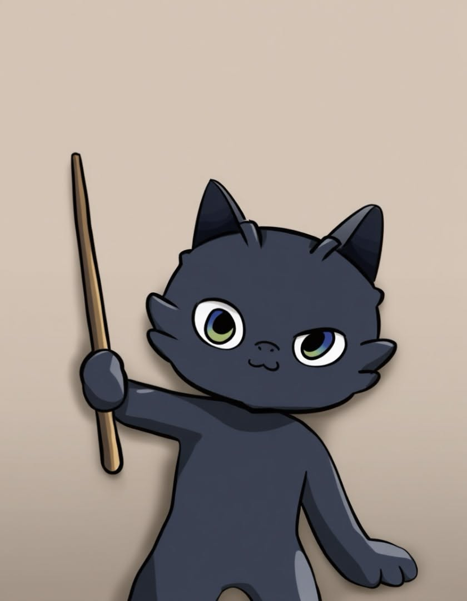

**Tool:** Sora (OpenAI video generation — extracted frame)

**Prompt:** dark blue cartoon cat holding a wooden stick, simple background, clean illustration

**What I see:** Centralized framing with the cat filling most of the frame. Soft even lighting with no distinct shadows. Limited palette of dark blue, brown, green, and blue eyes against a light tan background. Cartoonish style with thick outlines, simplified shapes, and flat colors.

**What I'd change:** The simple background could use a gradient or subtle texture to give the scene more depth without distracting from the character.

**Project context:** Sora exploration — testing how the model handles character consistency and simple object interaction in generated scenes.

---

## AI-12: Dusk Over the City

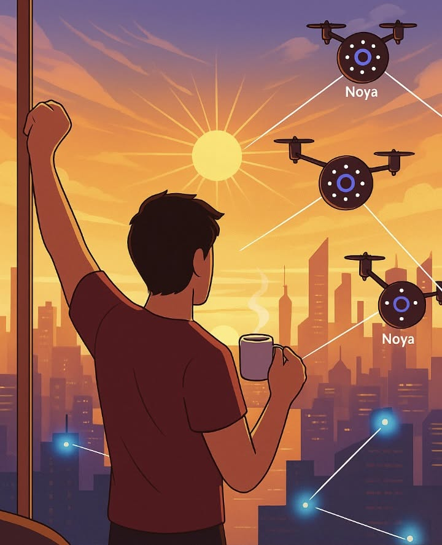

**Tool:** Sora (OpenAI video generation — extracted frame)

**Prompt:** man standing by a window looking out over a cityscape with drones, sunset silhouette, warm tones

**What I see:** Silhouette of the man in the foreground with a cityscape and sunset backdrop. Drones arranged in the sky create a futuristic atmosphere. Strong backlighting from the sunset with warm orange, purple, and brown tones dominating. Cartoonish flat illustration style with stylized line work.

**What I'd change:** Adding more detail to the silhouette (like subtle rim light defining the man's features) would strengthen the contrast between foreground and background.

**Project context:** Sora exploration — testing atmospheric scene generation, lighting, and environmental storytelling.

---

## AI-13: Storm Meditation

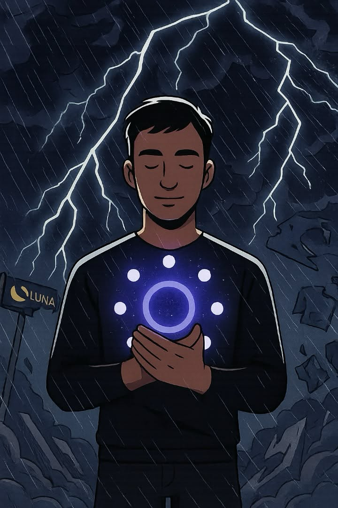

**Tool:** Sora (OpenAI video generation — extracted frame)

**Prompt:** man meditating and praying in a storm, energy emanating from his chest, lightning and rain

**What I see:** Symmetrical centered composition with the figure as the anchor. Dramatic lighting with the main source coming from the energy circle on the chest and lightning flashes. Predominantly cool blues and blacks with the glowing energy as the focal point. Stylized comic book inspired art with thick outlines.

**What I'd change:** The storm background could benefit from more depth layering — the lightning and rain feel flat against the dark sky. Adding distant clouds would create atmosphere.

**Project context:** Sora exploration — testing how the model handles dramatic lighting, weather elements, and character centered storytelling in single frames.

---

## AI-14: Flag Bearer

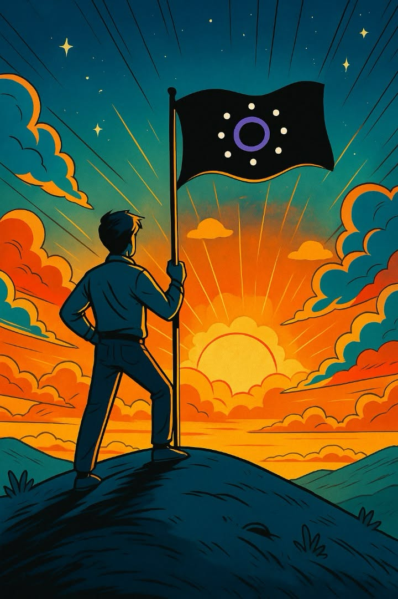

**Tool:** Sora (OpenAI video generation — extracted frame)

**Prompt:** person standing on a hilltop holding a flag, dramatic sunset background, vibrant colors

**What I see:** Person centered with the flag to the right against a dramatic sunset backdrop. Strong backlighting from the sunset creates silhouettes and warm orange hues. Vibrant cartoonish palette of blues, oranges, and yellows with limited shading. Graphic comic book inspired style with thick outlines.

**What I'd change:** The flag could use more detail or movement lines to suggest wind — it reads as static against the otherwise dynamic scene.

**Project context:** Sora exploration — testing the model's ability to compose heroic scenes with strong silhouette work and atmospheric lighting.

---

## AI-15: Night Vision

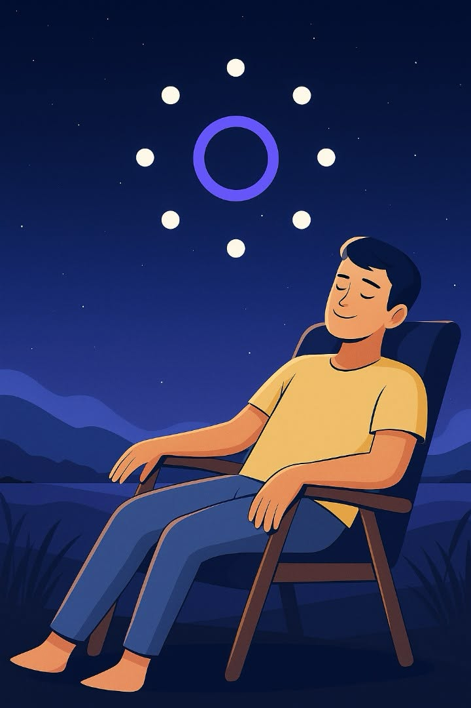

**Tool:** Sora (OpenAI video generation — extracted frame)

**Prompt:** man relaxing in a chair outdoors at night, gazing at a celestial symbol, lake and hills in background

**What I see:** Medium shot with the man in the foreground and a celestial symbol centrally placed above him. A landscape of lake and hills stretches in the background. Soft ambient lighting from the celestial symbol casts a glow onto the man's face and shirt. Deep blues for the night sky and landscape with a yellow shirt providing warm contrast. Simplified flat illustration with defined outlines.

**What I'd change:** The celestial symbol could be more defined and luminous — it currently reads as a shape rather than a magical or spiritual focal point.

**Project context:** Sora exploration — testing nighttime scene generation, ambient lighting, and reflective mood.

---

## AI-16: Pepe the Mage

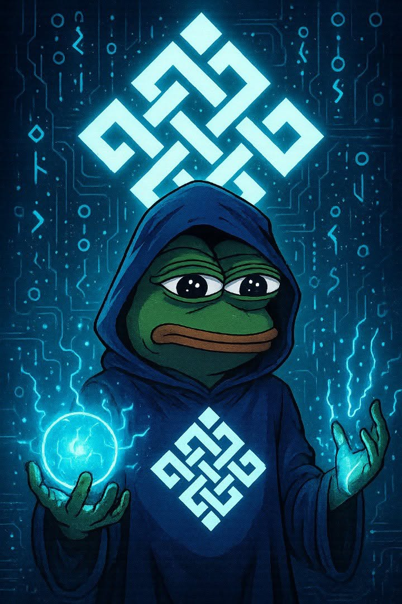

**Tool:** Sora (OpenAI video generation — extracted frame)

**Prompt:** Pepe the Frog character dressed in a hooded robe, holding a glowing energy sphere, tech inspired background with circuit designs

**What I see:** The character centered in frame with a tech inspired background of circuit designs and glowing elements. Lighting comes primarily from the blue glowing sphere, illuminating Pepe's face and hands. Blues and greens dominate the palette with a slightly textured painted look. Digital illustration with an almost matte painting quality to the rendering.

**What I'd change:** The hood obscures too much of the face — pulling the hood back slightly would let the character's expression carry more of the scene's emotional weight.

**Project context:** Sora exploration — testing character driven fantasy scenes with magical elements and atmospheric lighting.

---

[Back to home](./index) | [Autodesk Originals](./autodesk)
