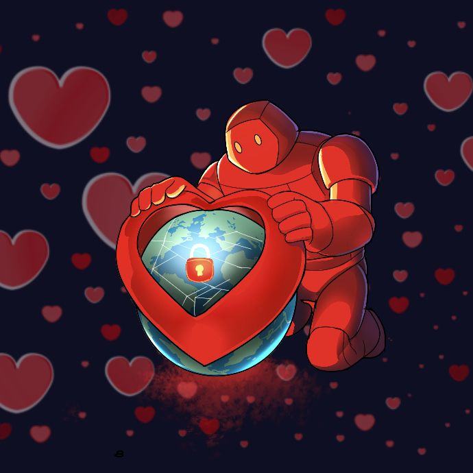
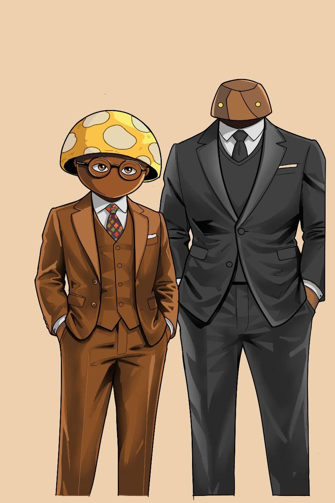
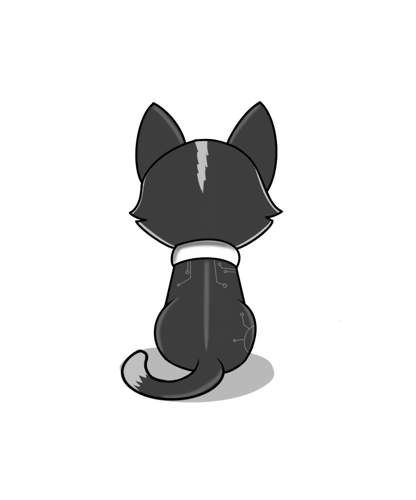
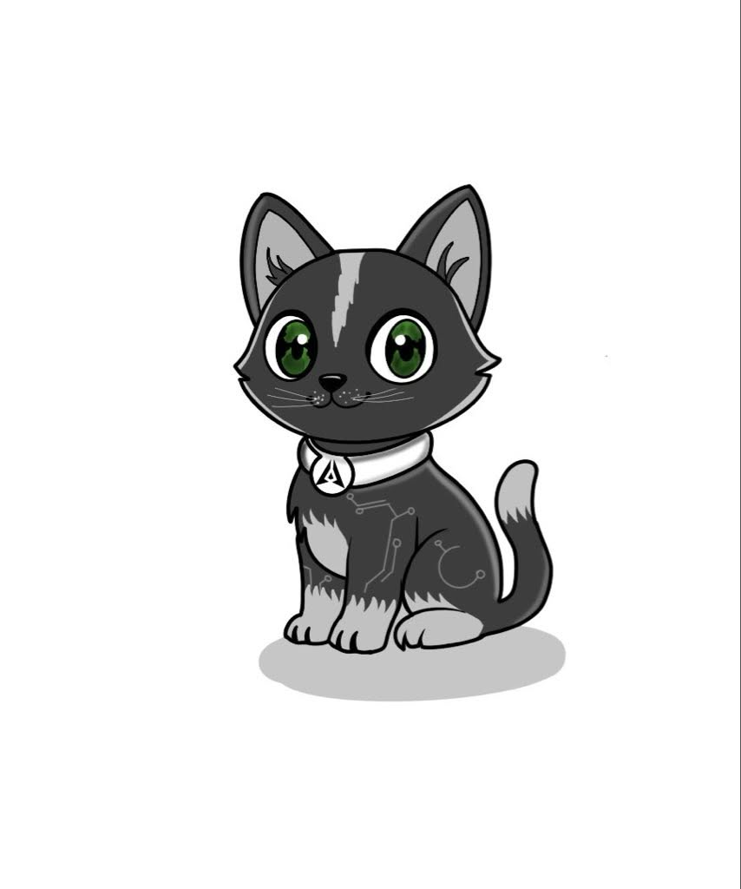
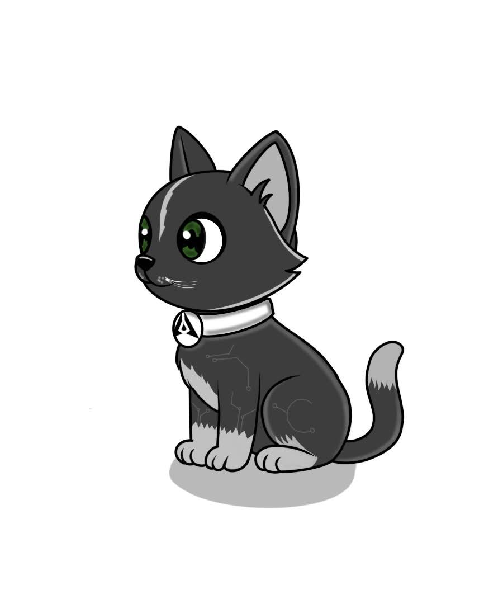
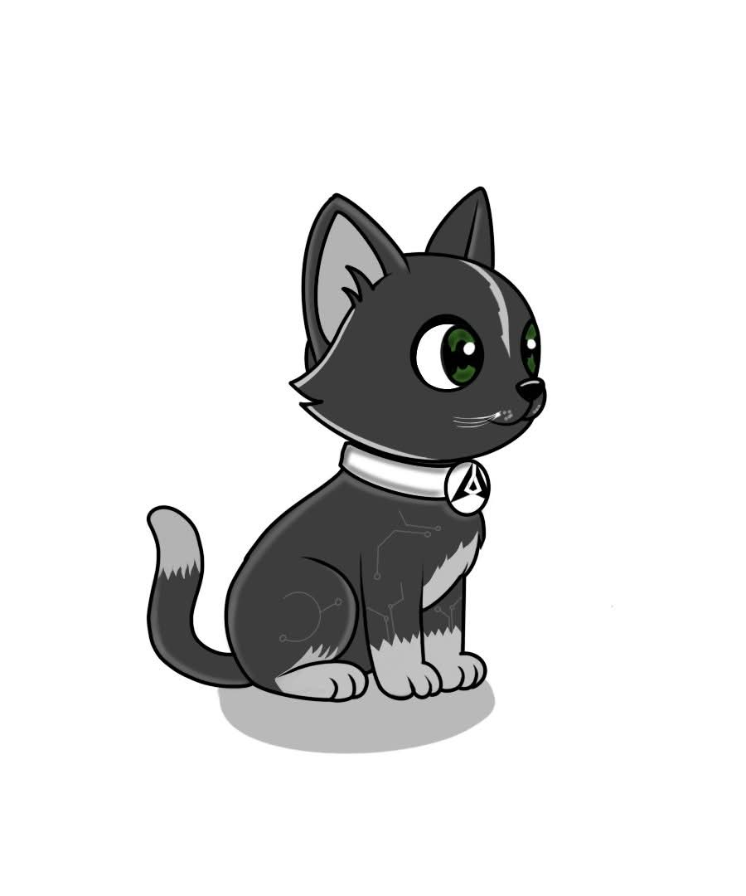
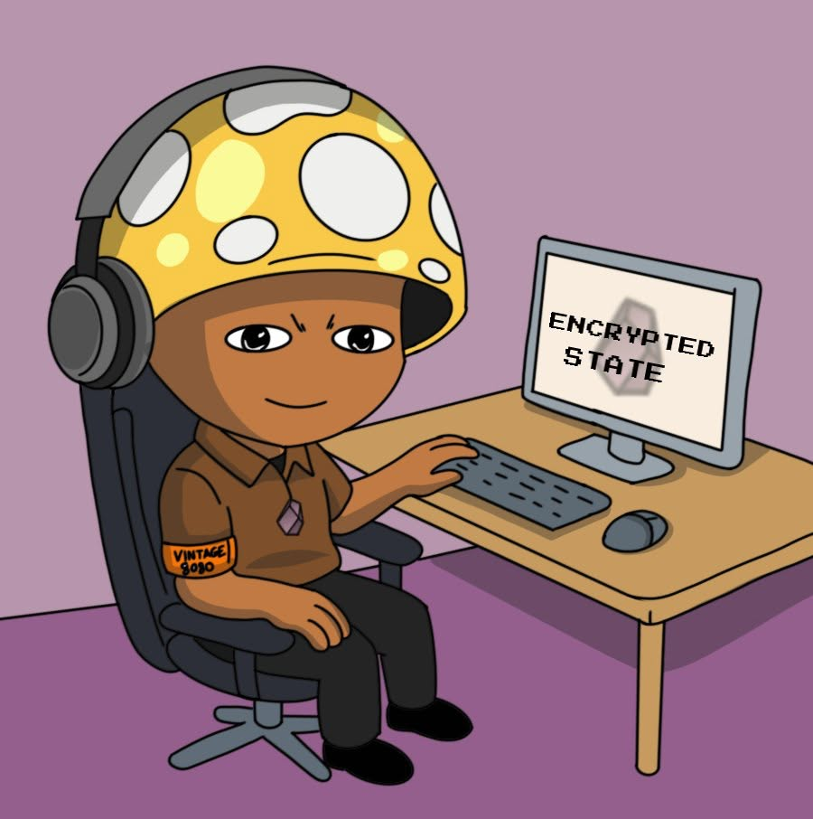
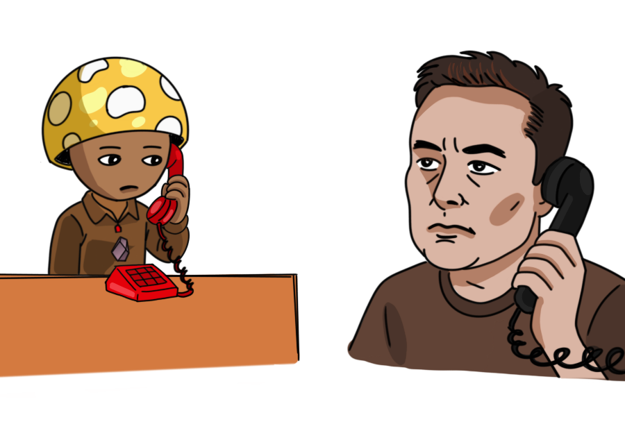
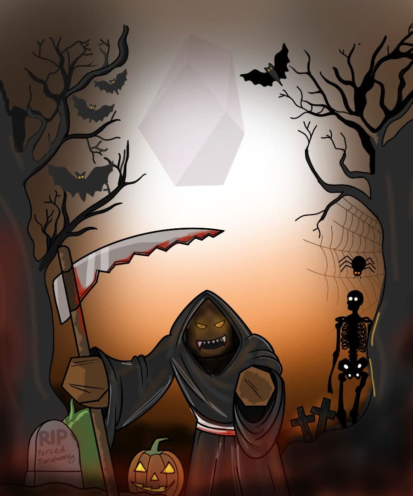
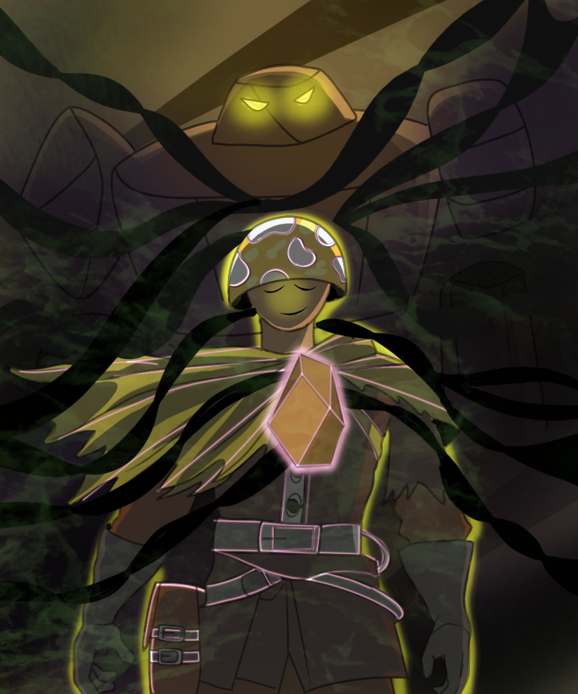

# Digital Art — Autodesk Originals

All 10 pieces created in Autodesk. Each entry demonstrates composition, lighting, color theory, and visual storytelling — the same skills this role applies to training Grok's image understanding.

---

## Art-01: Guardian of Privacy

**Subject:** A stylized red robot kneeling and cradling a glowing globe encased within a giant heart. A padlock sits on the globe, with digital network lines across the continents and scattered hearts in the background.

**Composition:** Centered, with the robot as the anchor and the heart globe as the primary focal point. The kneeling pose creates a protective, reverent framing.

**Lighting:** Focused glow emanates from the globe's center, illuminating the robot's metallic surface with highlights and casting shadows that define form. Dramatic and mood driven.

**Color:** Red robot and hearts contrast against a deep blue background. Warm center versus cool surroundings creates depth. The glowing globe adds a cyan accent.

**Style:** Digital illustration with a clean, slightly cartoonish aesthetic. Smooth gradients, metallic reflections, and atmospheric background.

---

## Art-02: Parallel

**Subject:** Two humanoid figures — one with a mushroom shaped head in a brown suit, the other with a dark stylized head in a black suit. Static, formal pose.

**Composition:** Symmetrical, balanced arrangement. The figures are centered and evenly weighted, creating order and tension through their contrast.

**Lighting:** Soft and even with subtle highlights and shadows. No distinct light source — flat, clean, professional presentation.

**Color:** Earthy palette of browns, blacks, and creams. Restrained and deliberate, contributing to a contemporary, art deco feel.

**Style:** Modern digital illustration with smooth gradients and strong silhouette contrast. Clean lines and minimal shading.

---

## Art-03: Solitude

**Subject:** A stylized cartoon animal figure seated, viewed from behind. Large ears, white collar, circuit like details on the back. Introspective pose.

**Composition:** Centered, with the back view creating a sense of solitude and mystery. The subject occupies the frame with balanced negative space.

**Lighting:** Soft, diffused. A subtle ground shadow anchors the figure without drawing attention from the subject.

**Color:** Grayscale — clean, minimal, and restrained. No color distractions, forcing focus on form and line.

**Style:** Modern minimalist illustration. Clear outlines, smooth shading, tech inspired details.

---

## Art-04: Circuit Cat

**Subject:** A stylized gray cat wearing a collar with circuit board patterns integrated into its fur design. Green eyes and clean silhouette.

**Composition:** Centered, subject dominates the frame. Simple static pose with the cat as the singular focal point.

**Lighting:** Soft and even — gentle mood with no harsh shadows. Subtle ground shadow for depth.

**Color:** Grayscale with green accents on the eyes and collar. High contrast between dark fur and white elements.

**Style:** Clean digital illustration with clear outlines. Tech aesthetic with commercial illustration quality.

---

## Art-05: Black Cat

**Subject:** A stylized black cat in a seated position, wearing a white collar with a geometric symbol pendant. Striking green eyes.

**Composition:** Off center placement creates dynamic visual interest. Medium shot framing with a simple cast shadow providing grounding.

**Lighting:** Soft and diffused — flat but deliberate. No strong directional source, maintaining a clean approachable look.

**Color:** Minimal — grayscale and black for the cat, white collar, pop of green in the eyes.

**Style:** Vector like digital art with a contemporary gaming or tech aesthetic. Simple shading, clean forms.

---

## Art-06: Digital Companion

**Subject:** A stylized cartoon cat with a modern aesthetic, wearing a digitally designed collar. Friendly, approachable expression.

**Composition:** Centered, substantial frame presence. The cat's face and collar are the clear focal points.

**Lighting:** Soft with a subtle cast shadow. Friendly, approachable mood.

**Color:** Grayscale fur with green eye accents and white collar details. Dark outlines define the cartoon form.

**Style:** Clean modern digital illustration with tech inspired design elements. Game and character design quality.

---

## Art-07: Encrypted State

**Subject:** A character with a mushroom shaped helmet and headphones seated at a desk. The computer display reads "ENCRYPTED STATE." The shirt says "Vintage 2080" with a pendant.

**Composition:** Well framed — character on the left, computer and desk filling the right side. Balanced domestic workspace scene.

**Lighting:** Soft and even — bright and cheerful mood. Highlights the character's face and the computer screen.

**Color:** Bright and warm — yellows, browns, and purple accents. Cheerful, approachable palette.

**Style:** Digital vector illustration with clean lines, simple shapes, and cartoonish character design. Story driven scene.

---

## Art-08: The Call

**Subject:** Two figures conversing on old fashioned telephones — a mushroom headed character at a desk and a figure resembling Elon Musk on the other end. Horizontal split composition.

**Composition:** Horizontal framing splits the scene — characters on opposite sides creating visual balance and narrative tension. The telephones connect them across the divide.

**Lighting:** Flat and even — cartoon style shading with no strong directional source. Neutral, readable mood.

**Color:** Earthy tones — browns, reds, white, and yellow accents. Warm, grounded palette.

**Style:** Simple cartoon aesthetic with heavy outlines and flat color fills. Expressive despite minimal facial detail.

---

## Art-09: Reaper's Night

**Subject:** Halloween scene — the Grim Reaper holding a bloody scythe in a graveyard. Bats, spiderwebs, and a jack o lantern frame the composition.

**Composition:** Centralized — the Reaper is the anchor, balanced by darker elements on each side including graves and pumpkins. The scythe creates a diagonal line of action.

**Lighting:** Eerie — moonlight from above with a creepy orange glow from the jack o lantern below. High contrast, dramatic shadows.

**Color:** Blacks, browns, and oranges with splashes of red. Classic Halloween palette with high contrast.

**Style:** Cartoon style horror — approachable rather than terrifying. Spooky but friendly holiday aesthetic.

---

## Art-10: Awakening

**Subject:** A character in a mushroom shaped helmet and armor with a large, ominous dark figure hovering behind them. Tendrils of darkness emanate outward. A glowing crystal on the chest serves as the light source.

**Composition:** Medium shot — character in the foreground with the dark figure looming behind. The chest crystal draws the eye as the radiant focal point.

**Lighting:** Dramatic — the crystal provides the primary light source, casting an eerie glow on the character while the background figure remains shrouded in shadow.

**Color:** Dark and muted with luminous yellowish green accents. White and pink outline glows add contrast and focus to central elements.

**Style:** Webcomic or video game art — flat colors with simple outlines. Story driven, atmospheric, with clear narrative tension.

---

[Back to home](./index)
